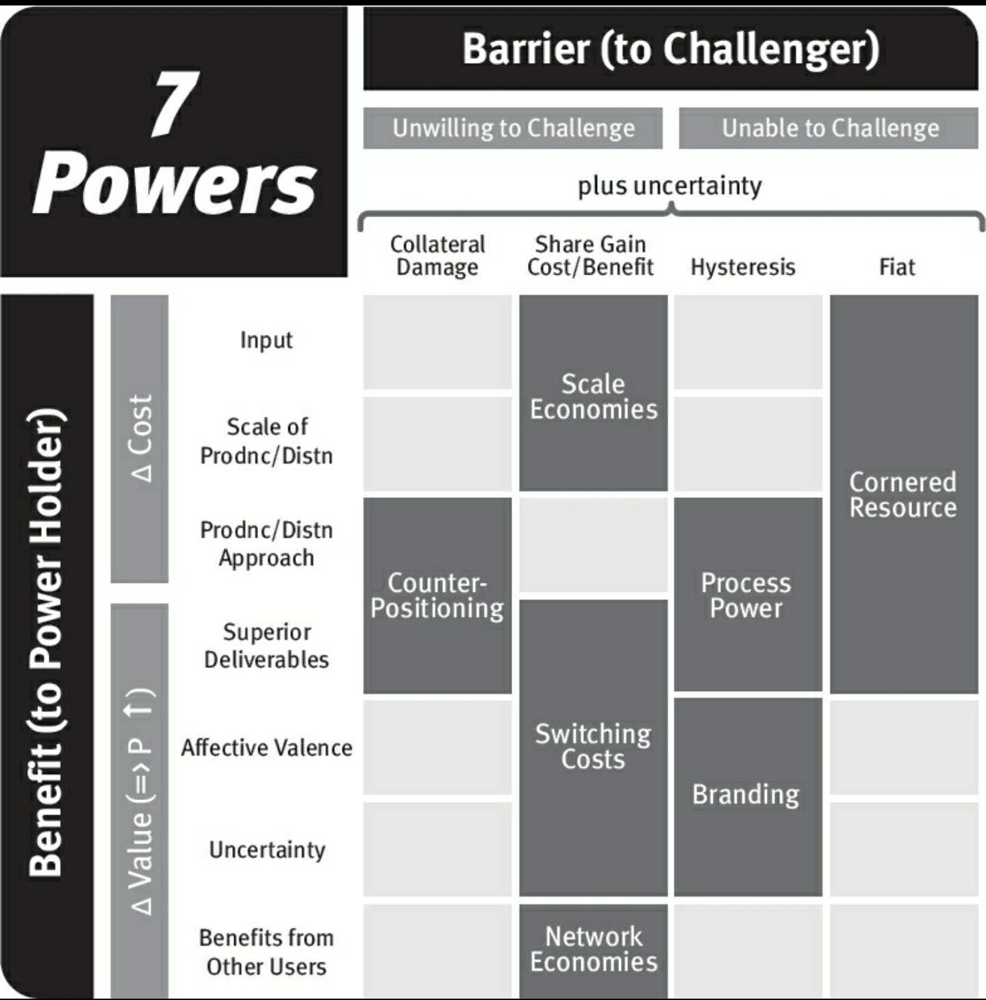

In his excellent book [7 Powers](https://www.amazon.com/7-Powers-Foundations-Business-Strategy-ebook/dp/B01MRLFFQ7), Hamilton Helmers lays out a strategic framework for thinking about long-term defensibility in business. He describes seven "powers," each combining a benefit and a barrier, that enable companies to create excess returns over the long run. 

For seed investors, I believe only three of these powers are investable: Network Effects, Scale Economies, and Switching Costs. Our asset class is predicated on home runs, and we are driven to invest in markets that we believe will be winner-take-most. These opportunities are characterized by increasing returns to scale. Out of Helmers' seven powers, only the aforementioned three inherently reward scale.

Network effects have been written about by others at great length, so I will spend no time on them. Suffice it to say that businesses which benefit from strong network effects are the prototypical example of increasing returns to scale.

Scale economies are similarly straightforward. Businesses with high operating leverage *relative to their competition* will realize economies of scale by amortizing their fixed costs over a larger volume, enabling them to charge less and/or retain more profit.

It is less immediately obvious how switching costs can drive winner-take-most outcomes. There is, however, a particular kind of switching cost which does result in this outcome: data scale effects, aka data moats. These effects combine the benefit of a superior deliverable with the barrier of the cost required for a competitor to gain share. As can be seen from the table at the beginning of this article, this is a switching cost in Helmers' taxonomy. There is a great deal of subtlety in understanding data scale effects, which I will defer to a later post. 

Helmers' other powers are no less valid than the three I have highlighted here, but they are much less investable at the seed stage. It is fairly obvious why a newly formed company is very unlikely to be able to benefit from Process Power, Branding, or a Cornered Resource. Counter-positioning is a more interesting example. Helmers has described this as his favorite power, and also as the only one that leaves the door open for imitators to follow on. Most significantly, it does not directly reward scale. As such, businesses relying on counter-positioning must find other means to scale quickly. Helmers' chosen case study for this form of power, Vanguard, took more than 20 years to reach escape velocity. Such long incubation periods are simply not suitable for the venture asset class. 

Venture, especially seed-stage venture, is a highly constrained asset class. It demands the nearly-impossible: ridiculous returns in a very short period of time. To have a prayer of achieving this goal, portfolio companies need every advantage that they can get. Businesses that can take advantage of one of these three powers become snowballs rolling down hill, accelerating as they grow. 