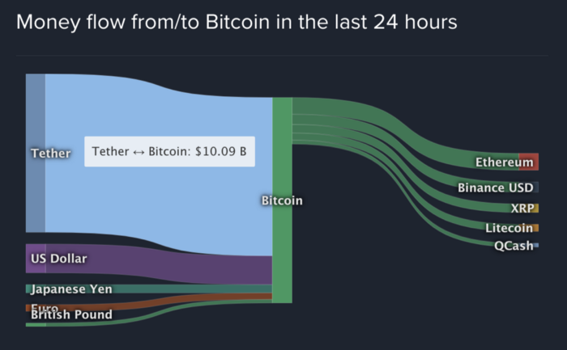
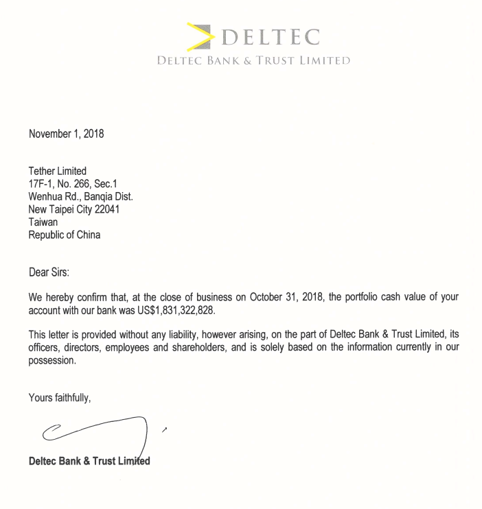

I recently came across [this post](https://crypto-anonymous-2021.medium.com/the-bit-short-inside-cryptos-doomsday-machine-f8dcf78a64d3) on HackerNews and got a bit of deja vu. In short, it argues that the recent appreciation in Bitcoin is built on top of a fraud being perpetrated by Tether Ltd. I was immediately reminded of the last boom/bust Bitcoin cycle, when others were making the same argument.

When I passed this article along to a crypto asset manager I know, he replied (I'm paraphrasing here), "There's no evidence that Tether is driving the appreciation of Bitcoin." There are certainly legitimate arguments to be made on both sides, but it's the wrong debate to be having. The more interesting question is, "Given the market landscape today and what we know of Tether, what is likely to happen next?"

The facts, dear reader, are these:

The post I referenced includes this datapoint, which I found shocking: a whopping two thirds of daily asset flows into Bitcoin are coming from Tether, and the same is true for Ethereum and several other popular cryptocurrencies.

There is also an ongoing investigation by the New York State Attorney General's office into iFinex, the company that operates both Bitfinex and Tether. This investigation is primarily focused on an alleged fraud originating from the use of Tether's cash reserves to paper over an undisclosed $900M loss by Bitfinex. On its face it does not directly implicate the legitimacy of Tether as a stablecoin. However, iFinex is subject to a court order mandating that it disclose documents to the NYAG. Though originally scheduled to be completed by Jan 15th of this year, the parties anticipate an additional "few weeks" are required to complete disclosure. 

It is also true that while Tether claims to be fully reserved, its total market cap is $24.8B. Meanwhile, the Bahamas (where Tether is purportedly banked) reports $5.4B in non-resident USD deposits. In 2018, when Tether announced its banking relationship, Tether had a market cap of $1.8B and produced the letter shown below from Deltec Bank as evidence that it was fully reserved at that time (note, however, the illegible scrawl and absence of any clearly legible signatory name). Tether has been very cagey about its banking relationships, so it remains theoretically possible that it possesses additional reserves elsewhere. 

Finally, there is a truly tiny daily volume for the direct USDT/USD currency pair: [less than $20M](https://coinlib.io/coin/USDT/Tether). According to the author (and this appears correct to the best of my ability to verify it), [Kraken](https://www.kraken.com/) is the largest USD banked crypto exchange that offers this trade. 

This itself is completely nuts. Daily volume for BTC/USDT is around $7B, and BTC/USD is roughly $2B. For the third leg of this tripod, USD/USDT to be less than 1% of the next largest by volume is puzzling, to say the least.

All of this paints a very troubling picture. It appears very probable that Tether is underreserved. If so, it is almost certain that the NYAG investigation will obtain conclusive proof of this. Presumably, that information would be disclosed during the course of the ensuing proceedings. 

If the market begins to lose confidence in the value of Tether, this whole system could unwind extremely quickly. Given the thinly traded USD/USDT market, any small disconnect in that echange rate could rapidly turn into a rush for the exit. It is entirely possible that we could see 60% or more of daily demand for BTC simply disappear overnight.

What happens after that depends on the nature of the demand underpinning the current USDT/BTC market. If, as the article contends, it is largely motivated by Tether giveaways and extravagant leverage, then we would expect a major long-term correction in BTC prices as denominated in USD. If instead the demand is largely "real," we would expect to see much of it migrate into alternative currencies until daily flows reach something like their current levels. 

Whether any of this comes to pass is quite speculative. It's entirely possible that Tether is sufficiently, if not fully, reserved and the NYAG uncovers no additional untoward information. Perhaps crypto only goes up. Time will tell.

